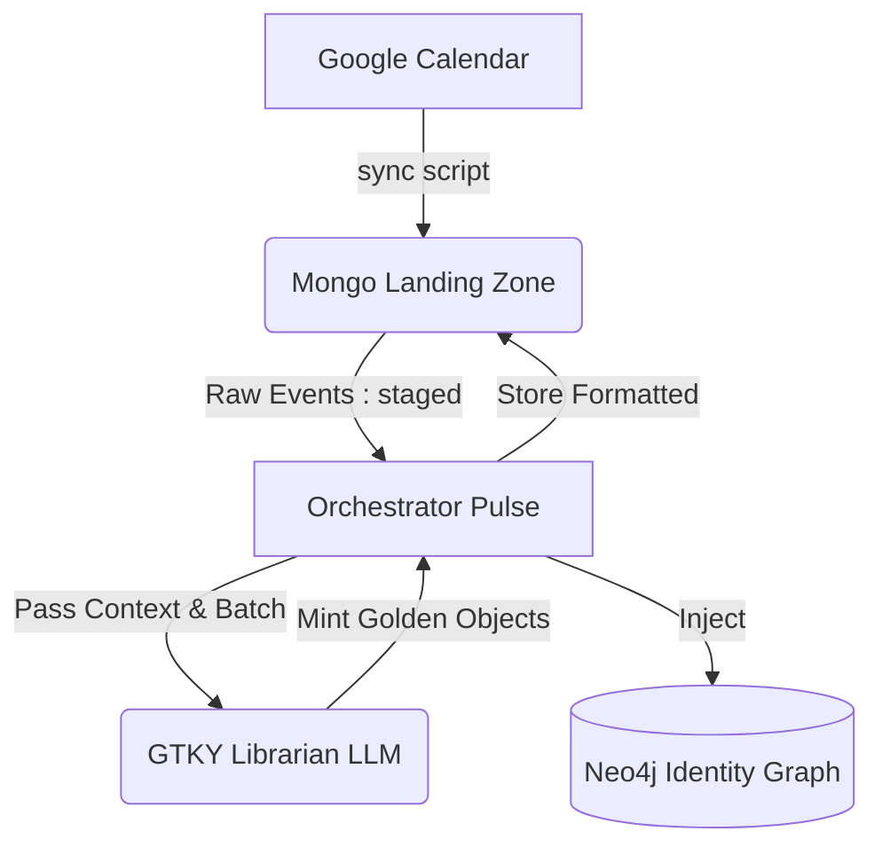

# GTKY Librarian: Phase 2 Classification Scaffolding

We successfully implemented the "Phase 2: LLM Classification" logic for the daily sync pulse!

## What Changed?

1. **Scaffolded Batch Logic in the Librarian**
   - Added `classify_daily_batch` to `gtky_librarian.py`.
   - Utilizes `ChatGroq` (`llama3-70b-8192`) to rapidly structure and classify data.
   - We extract `hero_origin.json` and `hero_ambition.json` artifacts internally, dynamically inserting them into the system prompt.
   - The method reads GCal output and enforces a rigid JSON schema, processing events in chunks of 10 to ensure safety limits are not hit while doing large daily pulses (e.g., 20+ events).

2. **Master Orchestrator Pipeline Rerouted**
   - We removed the basic dictionary formatting loop (`process_all_unstaged`) in `sync_calendar_to_graph.py`.
   - Replaced it with LLM-orchestrated classification:
     - Gets `raw_events` marked as `"staged"`.
     - Feeds them to `GTKYLibrarian.classify_daily_batch()`.
     - Writes the minted "Golden Objects" directly into the `formatted_collection` for permanent tracking.
     - Hands the final objects off to Phase 3 (`SovereignGraphInjector`) for Graph ingestion.

## Diagram

## Next Steps or Test
Whenever you execute `./src/orchestrators/sync_calendar_to_graph.py`, the system will now systematically classify calendar events and update both your Neo4j connections and MongoDB tracking collections using LLM reasoning.
