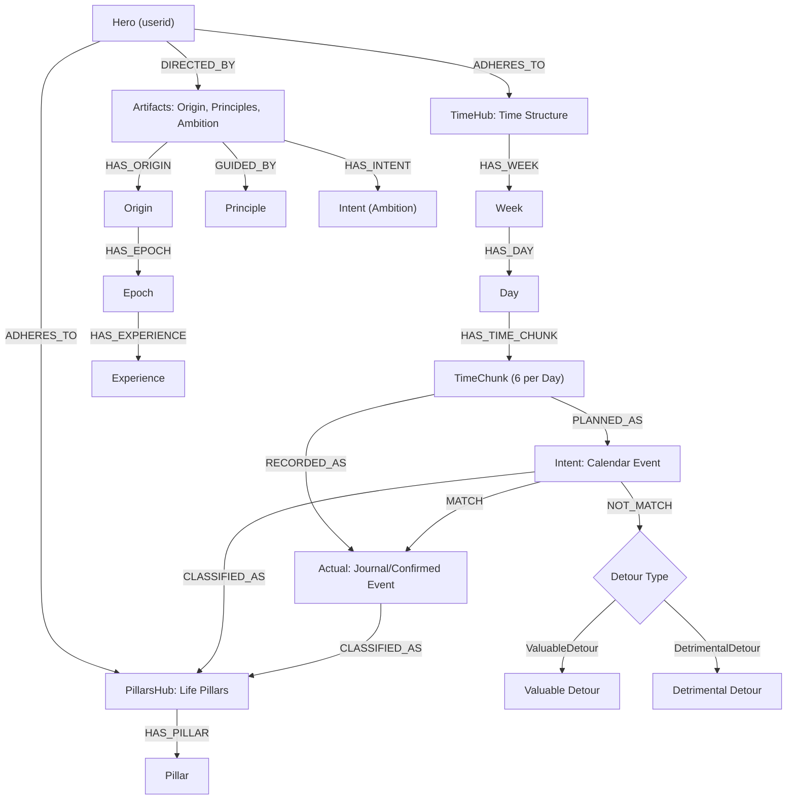

# Database Schema: The Identity Graph (Mach 4)

> **Last Updated:** 2026-07-13  
> **Source of Truth:** [graph_schema_mermaid.js](../Research/MongoDB_Neo4j_confirmation/graph_schema_mermaid.js) and [Possible_graph.png](../Research/MongoDB_Neo4j_confirmation/Possible_graph.png)

Unlike relational models, the Neo4j database uses a Graph architecture built to act as the user's "digital memory." Relationships are first-class citizens connecting goals across long periods of time. All interactions map the human transition from Intention (Blueprint) to Reality (Actual).

## 1. Canonical Graph Architecture (Mermaid)

## 2. Core Node Definitions

### Primary Nodes

| Label | Description | Key Properties |
| :---- | :---- | :---- |
| **`Hero`** | The sovereign identity of the porter user. Multi-tenant root. | `hero: String` (user display name) |
| **`Artifacts`** | Feature hub containing long-term static identity, intents, and principles. | `name: String` |
| **`PillarsHub`** | Feature hub for life pillar classifications. | `name: String` |
| **`TimeHub`** | Feature hub for temporal structure hierarchy. | `name: String` |

### Temporal Hierarchy

| Label | Description | Key Properties |
| :---- | :---- | :---- |
| **`Week`** | ISO week container. | `id: String` (e.g., `"2026-W28"`), `year: Int`, `week: Int` |
| **`Day`** | Day within a week. | `id: String` (e.g., `"2026-W28-D1"`), `day_of_week: Int` |
| **`TimeChunk`** | A 4-hour block within a day (6 chunks per day). | `id: String` (e.g., `"2026-W28-D1-C3"`), `chunk_index: Int` |

### Execution Nodes

| Label | Description | Key Properties |
| :---- | :---- | :---- |
| **`Intent`** | The desired plan or "Blueprint." Ingested from Google Calendar events. | `category: String`, `description: String`, `parent_category: String` |
| **`Actual`** | The "Ground Truth." What specifically occurred during the TimeChunk. | `activity: String`, `feeling: String`, `isValuableDetour: Boolean`, `brainFog: Integer` |
| **`Detour`** | A mismatch node created when Intent ≠ Actual. | `description: String`, `timestamp: DateTime` |
| **`ValuableDetour`** | Additional label on Detour — a positive, unplanned divergence. | *(inherits Detour)* |
| **`DetrimentalDetour`** | Additional label on Detour — a negative, unplanned divergence. | *(inherits Detour)* |

### Identity Nodes

| Label | Description | Key Properties |
| :---- | :---- | :---- |
| **`Principle`** | Core guiding principle from the Hero's ambition artifacts. | `text: String` |
| **`Pillar`** | A life domain classification (e.g., Health, Professional-growth). | `name: String` |
| **`Origin`** | Root node for the Hero's origin story. | `hero_name: String`, `name: String` |
| **`Epoch`** | A life chapter within the origin story. | `name: String`, `timeframe: String` |
| **`Experience`** | A specific experience within an epoch. | `title: String`, `epoch_name: String`, `description: String`, `status: String` |

### Supporting Nodes

| Label | Description | Key Properties |
| :---- | :---- | :---- |
| **`State`** | Emotional, energy, or time-of-day state linked to an Actual. | `type: String`, `value: String`, `timestamp: DateTime` |
| **`Reflection`** | LLM-generated or user reflection text. | `text: String`, `timestamp: DateTime` |
| **`Goal`** | A tracked goal node. | `description: String`, `category: String`, `priority: String`, `status: String` |

## 3. Relationship Map

### Primary Structure
1. `(Hero)-[:DIRECTED_BY]->(Artifacts)` — Links the Hero to their static memory hub.
2. `(Hero)-[:ADHERES_TO]->(PillarsHub)` — Links the Hero to their life pillar classifications.
3. `(Hero)-[:ADHERES_TO]->(TimeHub)` — Links the Hero to their temporal hierarchy.

### Temporal Hierarchy
4. `(TimeHub)-[:HAS_WEEK]->(Week)` — Weeks descend from the TimeHub.
5. `(Week)-[:HAS_DAY]->(Day)` — Days descend from Weeks (ISO calendar).
6. `(Day)-[:HAS_TIME_CHUNK]->(TimeChunk)` — Each day has 6 four-hour chunks.

### Execution Flow
7. `(TimeChunk)-[:PLANNED_AS]->(Intent)` — Calendar event mapped as planned intent.
8. `(TimeChunk)-[:RECORDED_AS]->(Actual)` — Journal/confirmed entry mapped as ground truth.
9. `(Intent)-[:MATCH]->(Actual)` — When intent aligns with actual.
10. `(Intent)-[:NOT_MATCH]->(Detour)` — When intent diverges from actual.
11. `(Detour)-[:IS_DETOUR]->(Actual)` — Links detour back to the actual event.
12. `(Intent)-[:CLASSIFIED_AS]->(Pillar)` — Pillar classification for events.
13. `(Actual)-[:CLASSIFIED_AS]->(Pillar)` — Pillar classification for actuals.

### Identity & Origin
14. `(Artifacts)-[:GUIDED_BY]->(Principle)` — Core principles guide the artifacts.
15. `(Artifacts)-[:HAS_INTENT]->(Intent)` — Ambition-level intents from Hero artifacts.
16. `(Artifacts)-[:HAS_ORIGIN]->(Origin)` — Origin story root node.
17. `(Origin)-[:HAS_EPOCH]->(Epoch)` — Life chapters.
18. `(Epoch)-[:HAS_EXPERIENCE]->(Experience)` — Experiences within chapters.
19. `(PillarsHub)-[:HAS_PILLAR]->(Pillar)` — Life domain pillars.
20. `(Intent)-[:HAS_SUB_INTENT]->(Intent)` — Nested intent hierarchy (e.g., "Loved ones" → "Romantic Goal").

### State & Reflection
21. `(Actual)-[:AFFECTED_BY]->(State)` — Emotional/energy states affecting actuals.
22. `(Actual)-[:HAS_REFLECTION]->(Reflection)` — Reflections on actuals.
23. `(Hero)-[:HAS_GOAL]->(Goal)` — Tracked goals.
24. `(Intent)-[:TARGETS]->(Goal)` — Intentions that target specific goals.
25. `(Actual)-[:ALIGNED_WITH]->(Goal)` — Actuals that contribute to goals.

## 4. Known Schema Drift (Code vs. Design)

> **⚠️ WARNING:** The following discrepancies exist between the canonical mermaid design and the current codebase. These must be resolved as part of ongoing Mach 4 development.

| Issue | Design (Mermaid) | Code Reality | File |
|-------|-----------------|--------------|------|
| **Node Label** | `Intent` | `Intention` (L64 of write_ops) | `write_operations.py` |
| **Relationship** | `PLANNED_AS` | `INTENDED` (L69) | `write_operations.py` |
| **Relationship** | `RECORDED_AS` | `RECORDED` (L82) | `write_operations.py` |
| **Missing Hub** | `TimeHub -> HAS_WEEK -> Week` | `Journal -> HAS_DAY -> Day` (old schema) | `write_operations.py` |
| **Missing Node** | `Delta` (documented in old schema) | Not created anywhere | N/A |
| **Missing Rel** | `CLASSIFIED_AS` (Pillar link) | Not implemented in write ops | `write_operations.py` |

## 5. Polyglot Persistence Strategy

### MongoDB (Flexible Document Store)
- **Raw landing zone** for Google Calendar API payloads
- **Formatted events** pre-processed for graph injection
- **Hero artifacts** (origin, ambition, detriments, category mapping)
- **Time-series collections** for sliding-window calendar ingestion

### Neo4j (Relationship Graph)
- **Identity Graph** — the canonical brain
- **Idempotent MERGE patterns** for Week/Day/TimeChunk hierarchy
- **Multi-tenant** via `hero` property on Hero nodes

### Weaviate Cloud / ChromaDB (Vector Search)
- **Semantic embeddings** for agent memory retrieval
- **Private Brain** document vectors
- **Pillar-based hybrid search** for contextual recommendations

## 6. Idempotency Strategy

The system utilizes pure `MERGE` patterns for temporal nodes (`Week`, `Day`, `TimeChunk`) and identity nodes (`Hero`, `Artifacts`, `PillarsHub`, `TimeHub`) to ensure that duplicate synchronizations with Google Calendar API streams do not bloat the database. Execution nodes (`Intent`, `Actual`) use `CREATE` for uniqueness.

The TimeChunk ID format (`YYYY-Www-Dd-Cc`) provides natural idempotency keys that are deterministic from any given datetime.
