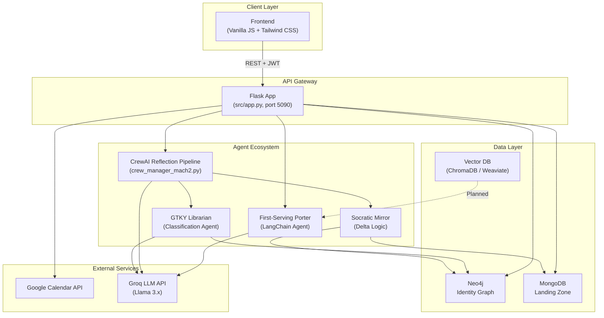
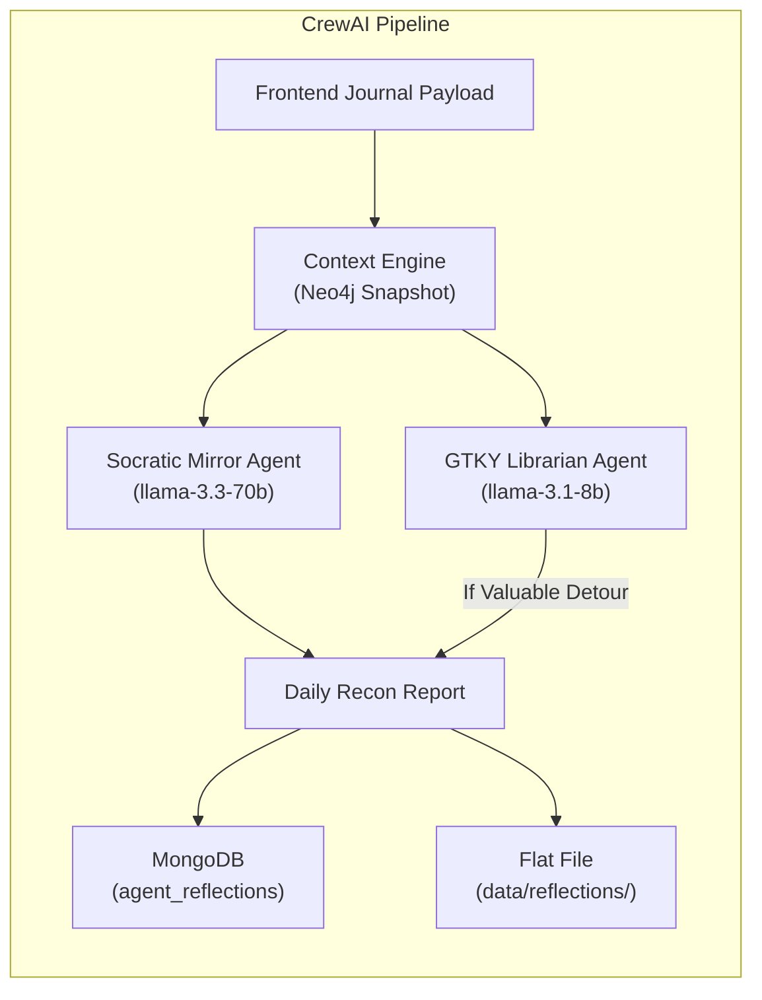
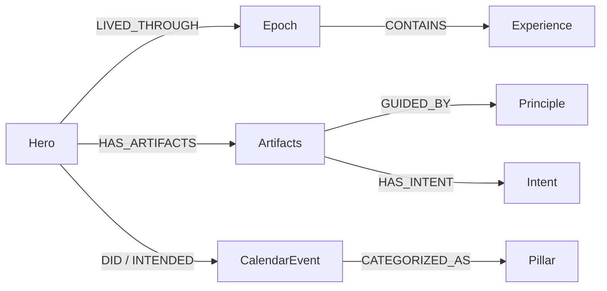
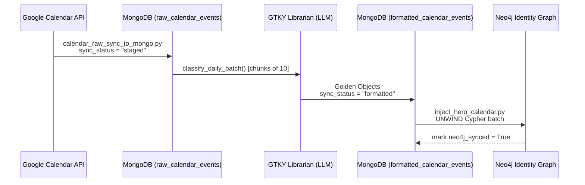
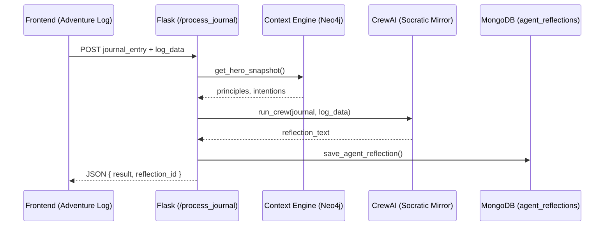
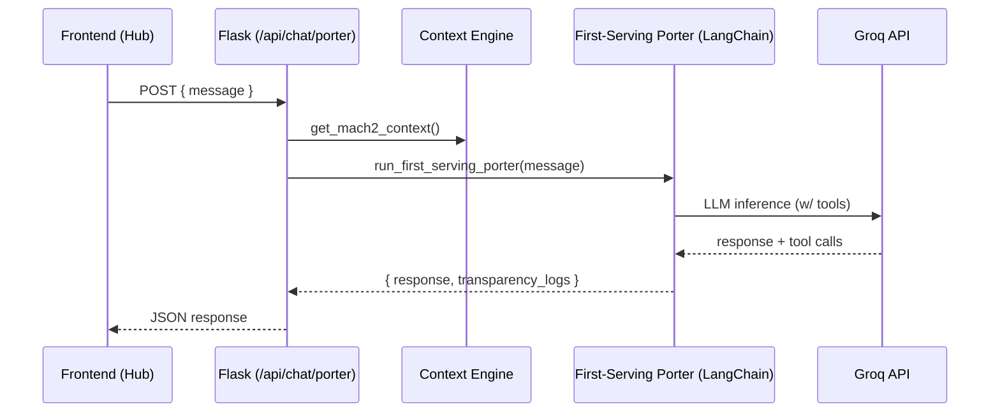
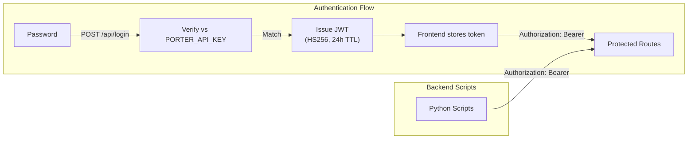
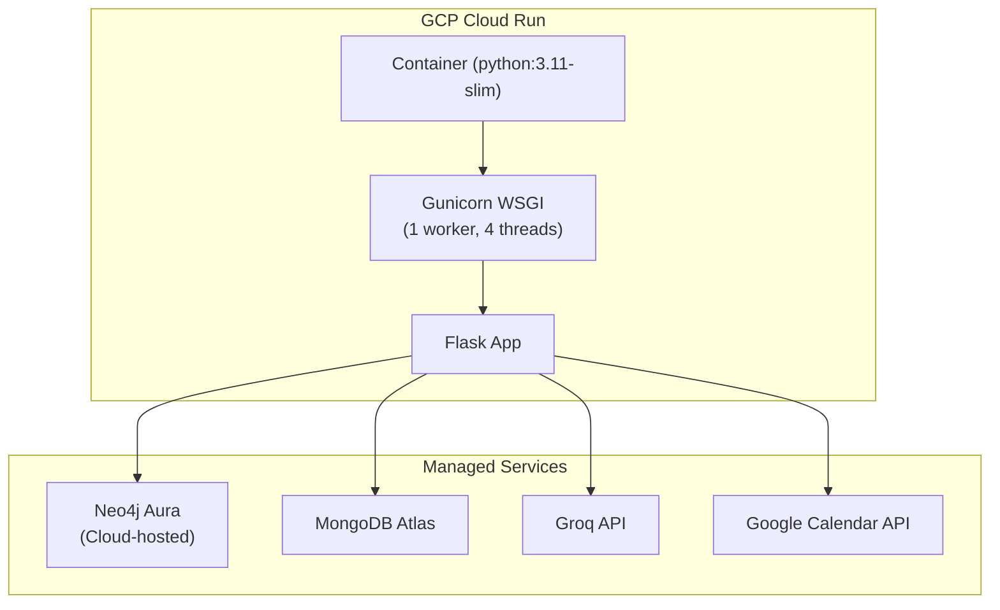

# Agentic Personal Porter — System Architecture

> **Generated from codebase audit on 2026-04-12.** This document maps the complete system topology as it exists today ("Mach 2" lifecycle).

---

## 1. High-Level Vision

The Agentic Personal Porter is a **sovereign intelligence layer** that compassionately bridges the gap between a user's _stated intentions_ and _actual actions_. It uses Maslow's Hierarchy, an "Origin Story," and declared "Ambitions" to calculate a numeric **Delta (Δ = Intent − Actual)** and produce Socratic reflections — never judgmental, always seeking "Valuable Detours."

---

## 2. System Topology

---

## 3. Directory Structure

| Directory | Purpose |
|---|---|
| [src/app.py](file:///home/bizon/Programming/Agentic_workflows/Agentic_personal_porter/src/app.py) | Flask application – **the single entry point**. Serves frontend, defines all API routes, handles auth. |
| [src/agents/](file:///home/bizon/Programming/Agentic_workflows/Agentic_personal_porter/src/agents) | All AI agent modules (CrewAI + LangChain) |
| [src/database/](file:///home/bizon/Programming/Agentic_workflows/Agentic_personal_porter/src/database) | Neo4j client, MongoDB storage, Context Engine, Graph Injectors, Vector DB clients |
| [src/integrations/](file:///home/bizon/Programming/Agentic_workflows/Agentic_personal_porter/src/integrations) | Google Calendar auth + parsing, Embeddings client |
| [src/orchestrators/](file:///home/bizon/Programming/Agentic_workflows/Agentic_personal_porter/src/orchestrators) | High-level pipeline runners (e.g., `sync_calendar_to_graph.py`) |
| [src/schemas/](file:///home/bizon/Programming/Agentic_workflows/Agentic_personal_porter/src/schemas) | Pydantic request validation models |
| [src/config.py](file:///home/bizon/Programming/Agentic_workflows/Agentic_personal_porter/src/config.py) | Centralized `NeoConfig` and `MongoConfig` classes |
| [frontend/](file:///home/bizon/Programming/Agentic_workflows/Agentic_personal_porter/frontend) | Static HTML pages + JS/CSS served directly by Flask |
| [rag_system/](file:///home/bizon/Programming/Agentic_workflows/Agentic_personal_porter/rag_system) | RAG pipeline for PDF ingestion (research papers) |
| [helper_scripts/](file:///home/bizon/Programming/Agentic_workflows/Agentic_personal_porter/helper_scripts) | Operational utilities (Neo4j snapshots, Mongo seeding, status checks) |
| [data/](file:///home/bizon/Programming/Agentic_workflows/Agentic_personal_porter/data) | Hero artifacts (JSON), reflections, calendar exports, ChromaDB store |

---

## 4. API Surface (Flask Routes)

All protected routes use the `@require_api_key` decorator, which accepts **either** a raw `PORTER_API_KEY` or a valid **JWT** (issued at `/api/login`).

| Route | Method | Auth | Purpose |
|---|---|---|---|
| `/` | GET | ✗ | Serve `index.html` (Hub dashboard) |
| `/login` | GET | ✗ | Serve `login.html` |
| `/adventure_log` | GET | ✗ | Serve Adventure Time Log page |
| `/journal_review` | GET | ✗ | Serve Journal Review page |
| `/oracle_predictions` | GET | ✗ | Serve Oracle Predictions page |
| `/inventory` | GET | ✗ | Serve Hero Inventory page |
| `/artifacts` | GET | ✗ | Serve Artifacts editor page |
| `/graph_explorer` | GET | ✗ | Serve vis-network Graph Explorer |
| `/api/login` | POST | ✗ | Password → JWT exchange (24h expiry) |
| `/api/save_log` | POST | ✓ | Save log → MongoDB + Neo4j (no AI) |
| `/process_journal` | POST | ✓ | Trigger daily CrewAI reflection pipeline |
| `/api/chat/porter` | POST | ✓ | Chat with First-Serving Porter (LangChain) |
| `/api/graph_data` | GET | ✓ | Fetch Neo4j graph topology for visualization |
| `/api/inventory` | GET | ✓ | Fetch "Valuable Detours" from Neo4j |
| `/api/artifacts/<name>` | GET/POST | ✓ | CRUD for `hero_origin.json`, `hero_ambition.json`, `hero_detriments.json` |
| `/get_calendar_events` | GET | ✓ | Live Google Calendar fetch for a date |
| `/api/admin/sync_calendar` | POST | ✓ | Trigger full GCal → Mongo → Neo4j sync pipeline |
| `/api/admin/inject_foundation` | POST | ✓ | Re-inject Hero Origin/Ambition into Neo4j |

---

## 5. Agent Ecosystem

The project runs a **dual-framework** agent architecture:

### 5.1 CrewAI — Batch Multi-Agent Orchestration

Used for intensive, synchronized reflections. Defined in [crew_manager_mach2.py](file:///home/bizon/Programming/Agentic_workflows/Agentic_personal_porter/src/agents/crew_manager_mach2.py).

| Agent | LLM | Role |
|---|---|---|
| **GTKY Librarian** (Curator of Truth) | `llama-3.1-8b-instant` | Identifies "Fog of War" in daily logs, logs "Valuable Detours" |
| **Socratic Mirror** (Growth Catalyst) | `llama-3.3-70b-versatile` | Calculates Δ, generates Socratic reflections, never judges |

### 5.2 LangChain — Low-Latency Direct Chat

Used for real-time user interaction. Defined in [first_serving_porter.py](file:///home/bizon/Programming/Agentic_workflows/Agentic_personal_porter/src/agents/first_serving_porter.py).

| Agent | LLM | Role |
|---|---|---|
| **First-Serving Porter** | `llama-3.3-70b-versatile` | Chief of Staff. Bridges User ↔ Identity Graph. Can delegate to sub-agents via `route_to_subagent` and `update_artifact` tools. Returns **transparency logs** of all tool calls. |

### 5.3 Standalone — GTKY Librarian (Classification Mode)

A separate batch-classification pipeline in [gtky_librarian.py](file:///home/bizon/Programming/Agentic_workflows/Agentic_personal_porter/src/agents/gtky_librarian.py) that:
1. Ingests `hero_origin.json` / `hero_ambition.json` into Neo4j as `Epoch`, `Principle`, `Intent` nodes
2. Classifies raw GCal events into **"Golden Objects"** using LLM (chunks of 10)
3. Feeds the sync orchestrator pipeline

### 5.4 Socratic Mirror Engine

Pure Python logic in [Socratic_mirror_logic.py](file:///home/bizon/Programming/Agentic_workflows/Agentic_personal_porter/src/agents/Socratic_mirror_logic.py):
- Calculates gap-aware Delta (detects "Fog of War" gaps > 60 minutes)
- Classifies events as: `Aligned`, `Valuable Detour`, `Fog of War`
- Generates a Socratic prompt for CrewAI consumption

---

## 6. Database Architecture (Triple-DB Ecosystem)

### 6.1 Neo4j — Identity Graph

The semantic relationship graph storing the Hero's identity, intentions, and calendar events.

**Key Constraint:** `gcal_id` uniqueness ensures idempotent MERGE operations.

**Access Layer:**
- [connection.py](file:///home/bizon/Programming/Agentic_workflows/Agentic_personal_porter/src/database/neo4j_client/connection.py) — Driver singleton
- [write_operations.py](file:///home/bizon/Programming/Agentic_workflows/Agentic_personal_porter/src/database/neo4j_client/write_operations.py) — `log_to_neo4j()`, calendar injection
- [read_operations.py](file:///home/bizon/Programming/Agentic_workflows/Agentic_personal_porter/src/database/neo4j_client/read_operations.py) — `get_full_graph_topology()`, `get_valuable_detours()`

### 6.2 MongoDB — Landing Zone & Operational Store

Database: **`porter_mach2`**

| Collection | Purpose |
|---|---|
| `raw_calendar_events` | Raw GCal data with `sync_status` tracking (`staged` → `formatted`) |
| `formatted_calendar_events` | Cleaned, AI-classified "Golden Objects" ready for Neo4j. Tracks `neo4j_synced` flag. |
| `journal_entries` | Direct frontend log submissions |
| `agent_reflections` | AI-generated daily Socratic reflections |
| `hero_artifacts` | Source-of-truth for `hero_origin.json`, `hero_ambition.json`, `hero_detriments.json` |
| **Planned Collections** | |
| `raw_gcal_timeseries` | Time-series calendar data |
| `event_intentions` | Structured intention records |
| `event_actuals` | Structured actual records |
| `unified_events` | Joined Intent-Actual with UUID linking |
| `semantic_vectors` | Vector embeddings for agent long-term memory |

**Access Layer:**
- [mongo_storage.py](file:///home/bizon/Programming/Agentic_workflows/Agentic_personal_porter/src/database/mongo_storage.py) — `SovereignMongoStorage` class (CRUD for all collections)
- [mongo_client/](file:///home/bizon/Programming/Agentic_workflows/Agentic_personal_porter/src/database/mongo_client) — Lower-level connection, event processor, UUID manager, time-series helpers

### 6.3 Vector Database — Long-Term Semantic Memory (In Progress)

| Client | File | Status |
|---|---|---|
| ChromaDB | [chromadb_client.py](file:///home/bizon/Programming/Agentic_workflows/Agentic_personal_porter/src/database/vector_database/chromadb_client.py) | Experimental |
| Weaviate | [weaviate_client.py](file:///home/bizon/Programming/Agentic_workflows/Agentic_personal_porter/src/database/vector_database/weaviate_client.py) | Experimental |

**Goal:** Enable unstructured semantic search for agents (journal memory, reflection recall). Currently pivoting to a local/sovereign solution with IVF/PQ compression to stay within a 1GB memory budget.

---

## 7. Data Flow Pipelines

### 7.1 Twin-Track Ingestion Pipeline (GCal → Mongo → Neo4j)

**Orchestrator:** [sync_calendar_to_graph.py](file:///home/bizon/Programming/Agentic_workflows/Agentic_personal_porter/src/orchestrators/sync_calendar_to_graph.py) — Runs all 5 phases in sequence. Triggered via `POST /api/admin/sync_calendar`.

### 7.2 Daily Reflection Pipeline (Frontend → CrewAI → MongoDB)

### 7.3 Porter Chat Pipeline (Frontend → LangChain → Response)

---

## 8. Context Engine

The [SovereignContextEngine](file:///home/bizon/Programming/Agentic_workflows/Agentic_personal_porter/src/database/context_engine.py) is the **bridge** between the Neo4j graph and the LLM agents:

1. **`get_hero_snapshot()`** — Queries `(Hero)-[:HAS_ARTIFACTS]->(Artifacts)-[:GUIDED_BY]->(Principle)` and `[:HAS_INTENT]->(Intent)` to extract the Hero's principles and active intentions.
2. **`analyze_day_delta()`** — Compares planned vs. actual events using the context.
3. **`calculate_delta()`** — Categorizes each event as:
   - `Forward Progress` — Matches intent exactly
   - `Valuable Detour` — Unplanned but aligned with an intention category
   - `Spontaneous Action` — Unplanned and unaligned
   - `Fog of War` — Uncategorized activity > 30 minutes
   - `High-Friction Deviation` — Planned but mismatched

---

## 9. Security Model

- **`PORTER_API_KEY`** — Raw key for backend scripts and admin endpoints
- **`JWT_SECRET`** — HS256 signing key for frontend session tokens
- **CORS** — Restricted to configured origins (default: `localhost:5000`, `localhost:5090`)
- **`.auth/` directory** — All secrets, OAuth tokens, and category mappings. Strictly `.gitignore`d.

---

## 10. Deployment Architecture

### Local Development
- `python src/app.py` — Flask dev server on port `5090`
- Frontend served directly by Flask's `send_from_directory`

### Production (GCP Cloud Run)
- **Dockerfile:** Multi-stage build → Python 3.11-slim → Gunicorn (1 worker, 4 threads, 300s timeout)
- **[deploy_gcp.sh](file:///home/bizon/Programming/Agentic_workflows/Agentic_personal_porter/deploy_gcp.sh):** Utilizes `sync_secrets_gcp.sh` to upload `.env` natively to **GCP Secret Manager**, binding them securely via `--set-secrets`.
- **Health Check:** `curl -f http://localhost:5090/` every 30s
- **Memory Budget:** 1024Mi
- **Port:** 5090

---

## 11. Frontend Architecture

A multi-page static application served by Flask:

| Page | File | Key JS | Purpose |
|---|---|---|---|
| Hub Dashboard | `index.html` | `hub.js` | Main dashboard with agent chat and status |
| Adventure Log | `Adventure_Time_log.html` | `app.js` | Daily time-chunk logging & reflection trigger |
| Inventory | `inventory.html` | `script.js` | Hero stats, Valuable Detours, equipment |
| Artifacts | `artifacts.html` | `artifacts.js` | Edit Hero Origin, Ambition, Detriments JSON |
| Graph Explorer | `graph_explorer.html` | `graph_explorer.js` | Interactive vis-network Neo4j visualization |
| Journal Review | `journal_review.html` | — | Historical journal/reflection viewer |
| Oracle Predictions | `Oracle_predictions.html` | — | Future prediction interface |
| Login | `login.html` | `auth.js` | Password → JWT authentication gate |

---

## 12. RAG System (Standalone)

Located in [rag_system/](file:///home/bizon/Programming/Agentic_workflows/Agentic_personal_porter/rag_system), this is a **separate** pipeline for research paper ingestion:

- [build_rag_index.py](file:///home/bizon/Programming/Agentic_workflows/Agentic_personal_porter/rag_system/build_rag_index.py) — PDF extraction and chunking
- [rag_service.py](file:///home/bizon/Programming/Agentic_workflows/Agentic_personal_porter/rag_system/rag_service.py) — Query service over indexed chunks
- [pipeline/](file:///home/bizon/Programming/Agentic_workflows/Agentic_personal_porter/rag_system/pipeline) — Processing stages
- [rag_core/](file:///home/bizon/Programming/Agentic_workflows/Agentic_personal_porter/rag_system/rag_core) — Core retrieval logic

Data stored in `data/chunks_*.json` and `data/papers/`.

---

## 13. Open Infrastructure Items

> [!IMPORTANT]
> These are tracked in [ACTIVE_BACKEND_TASKS.md](file:///home/bizon/Programming/Agentic_workflows/Agentic_personal_porter/Documentation/Current_Future_work/ACTIVE_BACKEND_TASKS.md) and represent incomplete or planned work.

| Area | Status | Detail |
|---|---|---|
| **Vector DB Production** | Planning | ChromaDB/Weaviate experimental clients exist; needs production MongoDB Atlas Vector Search |
| **Mongo Time-Series** | Planned | Intent-Actual schema with UUID linking across 4 new collections |
| **Neo4j Cloud Networking** | Resolved | Neo4j successfully migrated to an in-house GCP Compute Engine instance |
| **Cloud Cron (GCP Scheduler)** | In-Progress/Failing | Endpoint and Cron scripts built, but Cloud execution is currently failing (WIP) |
| **Agent Chat WebSocket** | Not started | Currently REST-only; WebSocket upgrade planned for real-time Porter chat |
| **Pulse Architecture** | Planned | Scheduled heartbeat batching for Neo4j writes (8 AM / 10 PM) |
| **Sovereign Neo4j Hosting** | Completed | Hosted on GCP Compute Engine Docker container with host-path volume mounts (/var/lib/neo4j/data) |
