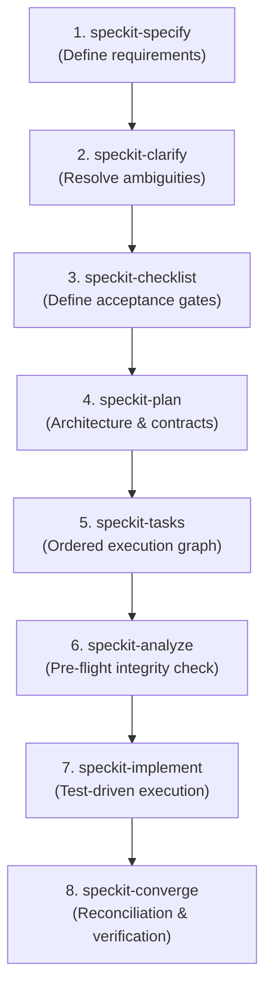

# Spec Kit Workflow & Skills Guide

This guide details how to use the **Spec Kit** commands and skills in this repository once initialized. Spec Kit governs our **Spec-Driven Development (SDD)** lifecycle, ensuring that all feature implementations adhere strictly to the project's [spec-kit-constitution.md](../architecture/spec-kit-constitution.md) and architectural invariants.

---

## 1. Overview & Philosophy

Spec-Driven Development reverses the traditional "code first, fix later" pattern. Development moves through a structured, gated progression:



### Directory Structure of a Feature
Every feature managed by Spec Kit lives in its own isolated directory under `specs/`:
```text
specs/
└── 001-evaluate-project-state/
    ├── spec.md                   # Functional specification and user scenarios
    ├── plan.md                   # Technical design & Constitution Check
    ├── tasks.md                  # Dependency-ordered task checklist
    ├── checklists/
    │   └── requirements.md       # Acceptance criteria checklist
    └── contracts/                # (Optional) API schemas, protobuf, or JSON specs
```

---

## 2. The Spec Kit Skills & Commands

The project includes 10 specialized Spec Kit skills located in `.agents/skills/`. You can invoke them in conversation with the agent using their slash commands or by asking the agent directly.

| Command / Skill | Phase | Primary Artifact | Purpose |
| :--- | :--- | :--- | :--- |
| **`/speckit-specify`** | Specification | `specs/NNN-feature/spec.md` | Creates a formal feature spec from natural language requirements. |
| **`/speckit-clarify`** | Refinement | `specs/NNN-feature/spec.md` | Identifies underspecified areas and asks up to 5 targeted questions. |
| **`/speckit-checklist`** | Validation Gate | `specs/NNN-feature/checklists/*.md`| Generates concrete criteria checklists to verify completion. |
| **`/speckit-plan`** | Design | `specs/NNN-feature/plan.md` | Drafts architectural design, contracts, and runs the Constitution Check. |
| **`/speckit-tasks`** | Task Graph | `specs/NNN-feature/tasks.md` | Breaks down `plan.md` into dependency-ordered, atomic tasks. |
| **`/speckit-analyze`** | Audit | Non-destructive report | Verifies cross-artifact consistency across `spec`, `plan`, and `tasks`. |
| **`/speckit-implement`** | Execution | Codebase (`src/`, `tests/`) | Executes tasks in `tasks.md`, running tests and linters per step. |
| **`/speckit-converge`** | Reconciliation | `specs/NNN-feature/tasks.md` | Audits the codebase against the spec and appends any unbuilt tasks. |
| **`/speckit-constitution`**| Governance | `.specify/memory/constitution.md` | Ratifies or amends project architecture rules. |
| **`/speckit-taskstoissues`**| Project Mgmt | GitHub Issues | Converts `tasks.md` checkboxes into tracked GitHub issues. |

---

## 3. Step-by-Step Feature Workflow

### Phase 1: Initialize the Feature Specification (`/speckit-specify`)

To start a new feature or major refactor, provide the user story and expected behavior:

```text
/speckit-specify Build a real-time event tooltip on the calendar showing pillar classifications and detour status
```

**What it does:**
1. Executes `.specify/scripts/bash/create-new-feature.sh`.
2. Allocates the next sequential feature folder (e.g., `specs/002-calendar-event-tooltip/`).
3. Generates `spec.md` populated with user scenarios, functional requirements, and edge cases.

---

### Phase 2: Clarify Requirements (`/speckit-clarify`)

Before writing technical architecture, resolve any underspecified edge cases:

```text
/speckit-clarify
```

**What it does:**
1. Scans `spec.md` for ambiguity, missing edge cases, or ambiguous data flows.
2. Prompts the human user with up to 5 targeted, multiple-choice questions.
3. Automatically encodes user answers directly back into `spec.md`.

---

### Phase 3: Generate Validation Checklists (`/speckit-checklist`)

Establish explicit definition-of-done criteria:

```text
/speckit-checklist
```

**What it does:**
1. Creates `specs/NNN-feature/checklists/requirements.md`.
2. Maps every requirement in `spec.md` to verifiable unit, integration, or UI test checks.

---

### Phase 4: Technical Planning & Constitution Check (`/speckit-plan`)

Translate the specification into concrete architectural designs:

```text
/speckit-plan
```

**What it does:**
1. Executes `.specify/scripts/bash/setup-plan.sh`.
2. Generates `specs/NNN-feature/plan.md`.
3. **Mandatory Constitution Check:** Verifies compliance against:
   * **Principle I:** Sensitive secrets in `.auth/` only; no plain-text comparisons (`hmac.compare_digest`).
   * **Principle II:** Multi-tenant scoping by `user_email` (no single-tenant hardcoding).
   * **Principle III:** Neo4j singleton pooling via Bolt; idempotent Cypher `MERGE`; batching over loops.
   * **Principle IV:** UI accessibility (WCAG labels, `:focus-visible`, $\le 3$ clicks).
   * **Principle V:** Non-destructive `.bk` backups and `.legacy_hr` archiving.

---

### Phase 5: Break Down Ordered Tasks (`/speckit-tasks`)

Transform the plan into an execution checklist:

```text
/speckit-tasks
```

**What it does:**
1. Executes `.specify/scripts/bash/setup-tasks.sh`.
2. Generates `specs/NNN-feature/tasks.md`.
3. Organizes tasks into strict dependency phases:
   * Setup & Scaffolding
   * Database Models & Migrations
   * Core Business Logic & Endpoints
   * Frontend Components & A11y
   * Verification Tests (`pytest`, pulse checks)

*(Optional: Run `/speckit-taskstoissues` if you wish to sync these tasks to your GitHub repository issue tracker).*

---

### Phase 6: Consistency & Quality Analysis (`/speckit-analyze`)

Run pre-flight verification before modifying code:

```text
/speckit-analyze
```

**What it does:**
* Performs non-destructive cross-referencing between `spec.md`, `plan.md`, and `tasks.md`.
* Checks for coverage gaps (e.g., a requirement in `spec.md` that lacks a corresponding task in `tasks.md`).
* Ensures zero constitution conflicts before coding begins.

---

### Phase 7: Implement (`/speckit-implement`)

Execute the tasks sequentially:

```text
/speckit-implement
```

**Execution Rules:**
1. **Pre-edit Backups:** Always creates a `.bk` backup file before modifying any existing file.
2. **Atomic Commits:** Checks off completed items in `tasks.md` as they are implemented.
3. **Verification Gating:** Runs `pytest` and relevant lint checks before declaring a task complete.
4. **Post-Task Cleanup:** Moves all temporary `.bk` files into `.legacy_hr/`.

---

### Phase 8: Final Reconciliation (`/speckit-converge`)

Ensure nothing was missed:

```text
/speckit-converge
```

**What it does:**
* Scans the written code against `spec.md` and `plan.md`.
* If any edge case or scenario was overlooked, appends the remaining items to `tasks.md` so `/speckit-implement` can finalize them.

---

## 4. Governing Principles & Best Practices

1. **Constitutional Precedence:** The project constitution in `documentation/architecture/spec-kit-constitution.md` is non-negotiable. If a planned implementation violates a principle (e.g. an unbatched loop or missing tenant scoping), the plan must be adapted.
2. **Artifact Retention:** When closing out a feature sprint:
   * Copy the finalized `task.md` and `walkthrough.md` to `agentic-private-brain/completed-tasks/` using kebab-case format (`YYYY-MM-DD-feature-name-task.md`).
   * Run `make sync-brain` to commit and push changes to the remote submodule repository.
3. **No File Deletions:** Always archive deprecated files into `.legacy_hr/` rather than deleting them.
